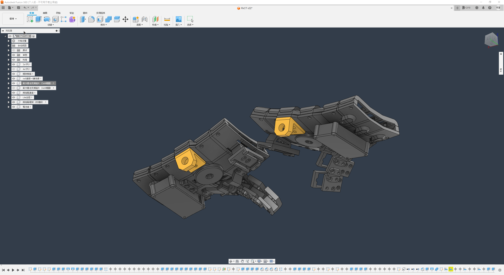

# Explorer Keyboard RxCT 探索者1號

## 簡介

RxCT是基於[Dactyl Manuform](https://github.com/abstracthat/dactyl-manuform)家族中的5x6、[Skeleton Edition](https://github.com/atsuyuki/dactyl-manuform-skeleton-edition-4x5)及[Bastardkb TBKmini](https://github.com/Bastardkb/TBK-Mini)這三把分離式鍵盤設計，其特點在於使用相機雲台作為主要固定方式，以3x5及4x5為鍵盤主配列，可向外側拓展1排按鍵，將鍵盤配列變更為3x6及4x6；拇指區基礎為1-4顆按鍵設計，可依據底板連接器橋接拇指區的每顆按鍵，再根據連接主鍵盤的基座，微調拇指區角度的分離式機械鍵盤。

## 特色

- 直列定位板、拇指按鍵模組化設計
- 可調整整體角度的拇指區
- 拇指最外側及最內側定位板可2檔微調
- 主要雲台安裝位於底殼，可外掛插件將雲台安裝在前端

## 組裝及操作說明

- [組裝說明書](guide.md) （WIP）
- [操作說明書](manual.md)

## 構造

- 底殼（3x5及4x5基礎大小）
- 拓展板（3x1及4x1）
- 框架（3x5、4x5及拓展1x1）
- 直列定位板（3x1及4x1）
- 拇指區基座
- 拇指定位板
- 拇指底板（2片可接基座、2片純拓展）
- 拇指底板連接器
- 主控座（可安裝TRRS、純MCU）
- 電池倉（2050規格聚合物鋰電池，3種厚度）
- 前方雲台插件
- 田字拇指區拓展（開發中）

## 構造圖

- 底殼、拓展板

- 框架

- 直列定位板

- 拇指區基座

- 拇指定位板、拇指底板、連接器

- 主控座、電池倉

- 前方雲台插件

## 特別感謝

- [Pragmatic務實鍵盤](https://github.com/jamessa/Pragmatic)及開發者[James Sa](https://github.com/jamessa)，在3D設計、3D列印、韌體代碼、[人體工學邏輯](https://www.youtube.com/watch?v=p7gZdOTpbP8)上的指導。
- [務實鍵盤官方網站](https://www.pragmatic.com.tw/)
- [Bastardkb](https://bastardkb.com/?fbclid=IwAR0HTUxLdHe8ZL2sCDtqDt270YRag5GlEKGHjyKge5UxckXjq_M7VrpKhu0) [TBKmini](https://bastardkb.com/product/tbk-mini-kit/)、[Dactyl Manuform](https://github.com/abstracthat/dactyl-manuform) 5x6、[Dactyl Manuform Skeleton Edition](https://github.com/atsuyuki/dactyl-manuform-skeleton-edition-4x5)，沒有接觸到你們，也不會有探索者的誕生。
- [開發日誌](log.md)
