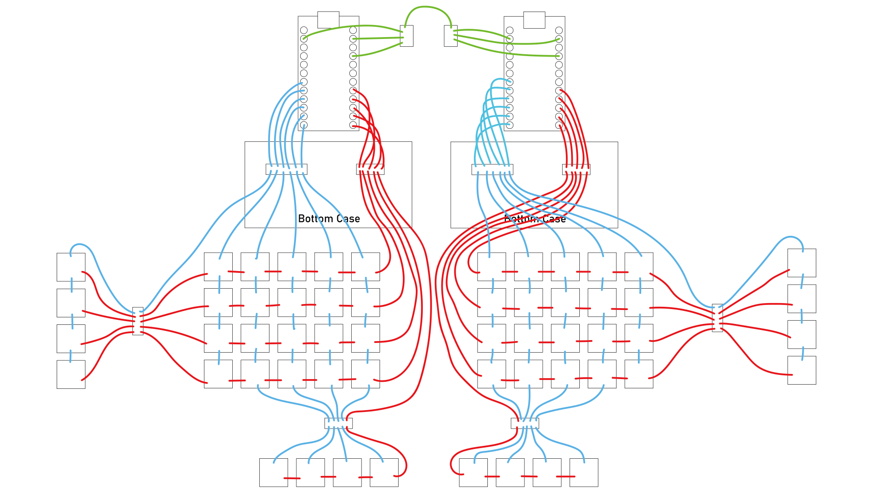
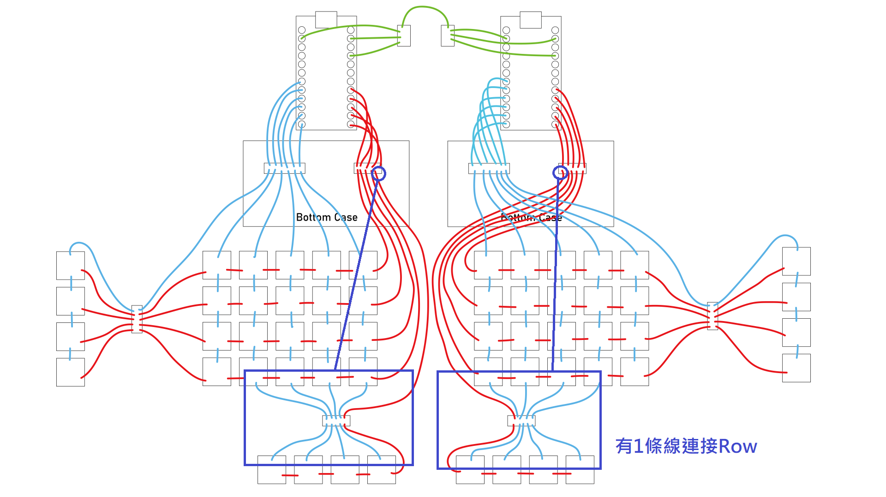
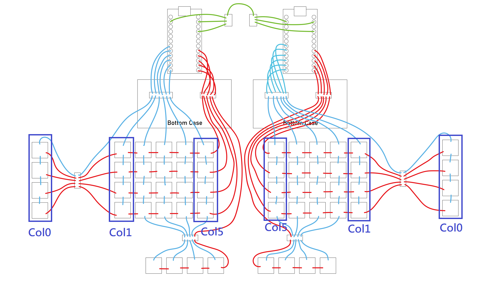

# 組裝說明（Building Guide）
## 安全注意事項

> **Warning**
>
> 使用電烙鐵時注意環境通風。
> 部分零件在壓製熱壓螺母時需要用手做固定及公差微調，注意不要燙傷。
> 3D列印的部件相當脆弱，務必不要過度用力彎折、摔、掉落、螺絲硬鎖等行為。

## 工具準備

- 溫控電烙鐵及相關工具配件。
- 烙鐵工作臺（帶夾子固定、吸磁固定為佳）
- 剝線鉗。
- 美工刀。
- 切割墊。
- 精密螺絲起子。
- 寬頭鑷子。
- 小剪刀
- 熱風槍。
- 超黏無痕雙面膠。
- 絕緣膠帶。
- 1u鍵帽若干。

## 材料準備

- 熱壓螺母及螺絲的使用量相當多，推薦直接買一包備著用。
- 能夠在同一個賣場買就在同一個賣場買，比較省錢。
- 推薦使用單格電路板組裝，邏輯比較好懂，也比較好拉矩陣佈線。
- 電線不一定要按照表格上標示的顏色購買，2種不同的顏色即可，方便走線佈線及防呆。

| 材料名稱 | 左右手合計最大用量 | 相關連結 |
| -------- | ---- | ------ |
| M2x3x3.2mm 熱壓螺母 | 76 | [Link](https://detail.tmall.com/item.htm?_u=n3lhas116742&id=673922235027&spm=a1z09.2.0.0.18132e8d8onSZm) |
| M3x3x4.2mm 熱壓螺母 | 62 | [Link](https://detail.tmall.com/item.htm?_u=n3lhas116742&id=673922235027&spm=a1z09.2.0.0.18132e8d8onSZm) |
| M2x5mm 薄頭螺絲 | 50 | [Link](https://detail.tmall.com/item.htm?_u=n3lhas111f9d&id=595144522232&spm=a1z09.2.0.0.18132e8d8onSZm) |
| M2x8mm 薄頭螺絲 | 22 | [Link](https://detail.tmall.com/item.htm?_u=n3lhas111f9d&id=595144522232&spm=a1z09.2.0.0.18132e8d8onSZm) |
| M3x6mm 薄頭螺絲 | 54 | [Link](https://detail.tmall.com/item.htm?_u=n3lhas111f9d&id=595144522232&spm=a1z09.2.0.0.18132e8d8onSZm) |
| M3x8mm 薄頭螺絲 | 2 | [Link](https://detail.tmall.com/item.htm?_u=n3lhas111f9d&id=595144522232&spm=a1z09.2.0.0.18132e8d8onSZm) |
| M3x6mm 扁頭螺絲 | 8 | [Link](https://detail.tmall.com/item.htm?_u=n3lhas11735e&id=624733978863&spm=a1z09.2.0.0.18132e8d8onSZm) |
| 1/4" 高6.35mm 熱壓螺母 | 4 | [Link](https://item.taobao.com/item.htm?spm=a1z0d.6639537/tb.1997196601.82.3d385886uNMAFA&id=662099841891) |
| Pro Micro 5V16M | 2 | [Link](https://item.taobao.com/item.htm?spm=a1z09.2.0.0.18132e8d8onSZm&id=682095206177&_u=n3lhas111158) |
| TRRS座 | 2 | [Link](https://detail.tmall.com/item.htm?_u=n3lhas11d3b2&id=609114863623&spm=a1z09.2.0.0.18132e8d8onSZm) |
| 28AWG 白色矽膠線 | N/A | [Link](https://item.taobao.com/item.htm?spm=a1z09.2.0.0.18132e8d8onSZm&id=45709657945&_u=n3lhas114d82) |
| 28AWG 紅色矽膠線 | N/A | [Link](https://item.taobao.com/item.htm?spm=a1z09.2.0.0.18132e8d8onSZm&id=45709657945&_u=n3lhas114d82) |
| 2.54mm 圓排針公 | N/A | [Link](https://item.taobao.com/item.htm?spm=a1z09.2.0.0.18132e8d8onSZm&id=627707215622&_u=n3lhas11f450) |
| 2.54mm 圓排針母 | N/A | [Link](https://item.taobao.com/item.htm?spm=a1z09.2.0.0.18132e8d8onSZm&id=627818679656&_u=n3lhas11659a) |
| 外徑1mm 熱縮套管 | N/A | [Link](https://shopee.tw/(%E5%8F%B0%E7%81%A3%E5%A4%A7%E5%BB%A0%E8%A3%BD)%E9%80%8F%E6%98%8E%E7%86%B1%E7%B8%AE%E5%A5%97%E7%AE%A1%E8%B3%A3%E5%A0%B4-%E7%86%B1%E7%B8%AE%E5%A5%97%E7%AE%A1-%E9%98%B2%E5%A1%B5%E5%A5%97-%E7%B5%95%E7%B7%A3%E7%AE%A1-%E7%AB%AF%E5%AD%90%E7%AE%A1-%E7%B5%95%E7%B7%A3-%E7%86%B1%E7%B8%AE%E7%AE%A1-%E7%86%B1%E7%B8%AE%E8%86%9C-%E7%86%B1%E7%B8%AE%E5%A5%97-%E8%9D%A6%E7%AB%BF-%E9%87%A3%E7%AB%BF-%E7%AB%AF%E5%AD%90-i.42958561.3656848147) |
| 單格電路板 | 56 | [Link](https://www.pragmatic.com.tw/shop/single-switch-pcb-101#attr=) |
| 1N1418 貼片式T4 開關二級管 | 56 | [Link](https://detail.tmall.com/item.htm?_u=n3lhas111e26&id=614392649945&spm=a1z09.2.0.0.18132e8d8onSZm) |

## 列印注意事項

- 根據需求先決定自己需要3x5、3x6或4x5、4x6等鍵盤主配列，如果不清楚的話，請先決定自己的鍵盤要幾排（Row）按鍵。
- 不知道拇指要幾顆按鍵，請全部列印出來。
- 這把鍵盤叫做探索者，就如其名，它需要你慢慢探索鍵盤按鍵中的奧祕。

## 配列部件表

- 部分組件為對稱設計，但檔案數量龐大，還是將組件建立成左右區分，方便大家列印時參考用。

| 部件名稱 | 左右區分 | 選項A | 選項B | 備註 |
| ------- | ------- | ----- | ----- | ---- |
| 直列定位板（column） | - | 3x1 | 4x1 | 5列鍵盤需列印10組、6列12組 |
| 底殼（bottom case） | Yes | 3x5 | 4x5 | - |
| 底殼拓展（bottom expand case） | Yes | 3x1 | 4x1 | - |
| 上框架（upper main frame） | Yes | 3x5 | 4x5 | 3x5、4x5不共用 |
| 共用下框（lower main frame） | Yes | - | - | 3x5、4x5通用 |
| 拓展框架（x1-main frame） | - | - | - | 一組左右拓展需列印4組 |
| 前方雲台插件（front basepart） | Yes | - | - | 左右邊可通用 |
| 拇指區基座（thumb area basepart） | Yes | - | - | - |
| 拇指定位板（x1-thumb plate） | - | - | - | 依據拇指按鍵數量列印 |
| 拇指底板AX（thumb AX plate） | Yes | AA（長板） | AB（短板） | 可連結基座 |
| 拇指底板BX（thumb BX plate） | Yes | BA（長板） | BB（短板） | 純拓展，左右通用 |
| 連接器（linker） | - | - | - | 左右通用，2組按鍵需用1組連接器 |
| TRRS主控底座（trrs mcu base） | Yes | MCU卡扣（mcu stuck） | TRRS卡扣（trrs stuck） | - |
| 無線主控底座（mcu base） | Yes | MCU卡扣（mcu stuck） | - | 左右通用 |
| 斜角插件（mcu base angle） | Yes | - | - | 左右通用，必要組件 |
| 電池倉上蓋（case cover） | Yes | - | - | 左右通用，厚度通用 |
| 電池盒（box） | Yes | - | - | 左右通用，2050（20x50mm）規格，厚度6mm、8mm、10mm可選 |

## 組裝步驟

- 3x5、3x6及4x5、4x6鍵盤配列安裝大同小異，這裡會以配列最大的4x6+4鍵盤演示為主。
- 簡單的一個邏輯，跟外殼連接相關使用M3，跟定位板相關使用M2，請依據這個邏輯進行安裝。
- 第一步先安裝熱壓螺母，電烙鐵使用定溫200度即可，溫度太高PLA外殼會融化。

### （一）熱壓螺母

- 探索者1號會使用到M2x3x3.2mm、M3x3x4.2mm及英制1/4"高6.35mm三種規格之熱壓螺母，每個部件都會按照下圖的顏色做標示，方便安裝。

- Column-3x1、4x1：

- x1-thumb plate：

- thumb AA plate、thumb AB plate：

- thumb BA plate、thumb BB plate：

- linker：

- 4x6 bottom case，3x6會少用1個M3螺母，安裝方式大同小異：

- box：

- trrs mcu base、mcu base，安裝方式一樣：

- mcu base angle：

- front basepart：

### （二）外殼安裝順序

- 探索者1號由於是模組化設計，大體設計出來的部件數量相當龐大外，如果不瞭解如何安裝外殼，後續的安裝步驟會很困難，務必將各個部件的安裝方式及步驟記下。

#### A、外殼部分

- 首先將主控座的部分用螺絲固定上：

- 再將斜角插件固定在主控座上：

- 主控座的部分會在製作排線的時候再繼續做介紹，先知道要如何安裝卡扣就好。

- 上框及下框的部分具有防呆機制，上框中指區會有2個孔、下框只會有1個孔，這點務必留意。

- 首先用M2x5的螺絲將框架及Column都固定上去，個人建議從最外側往內安裝會比較好固定。

- 如果要安裝拓展的話，務必留意x1-main frame的螺絲安裝方向：

#### B、拇指區

- 拇指區基座部分由M3x8mm螺絲當作軸心、M2x5螺絲做角度固定，只有thumb BA plate、thumb BB plate可以連結基座，這裡再強調一次：

- 基座部分可以調整的角度為0～90度合計7個檔位，其中75度及90度檔需要使用M2x5mm規格之扁頭螺絲，基本不建議安裝。

- 拇指按鍵底板的部分特別留意安裝角度：

- 接著再安裝背面：

- 將拇指按鍵、基座組合在一起，選定好喜歡的角度後進行固定：

- 最後將拇指定位板安裝上去：

- 拇指定位板根據型號A的長板可進行定位板前後6mm微調，根據自己喜好安裝即可：

- 拇指區安裝完畢：

- 底殼底部雲台座部分先使用防滑腳貼貼在雲台接觸面上，由於PLA材質問題只有單雲台有防滑機制的話會無法穩固鍵盤本體。

- 然後將4x5定位板、拇指區及底殼合併。

- 最後將鍵盤本體安裝在雲台上就完成了。

> **Notice**
> 完成外殼後務必先安裝鍵軸及鍵帽測試是不是適合自己，不適合的話再做微調，直到滿意為止。

- 務必留意拇指區按鍵數量推薦焊接前先決定好，本篇組裝說明只會解說固定4鍵的拇指區。

- 如果有需要安裝拓展，安裝方式如下：

### （三）配線圖及原理

- 探索者1號使用的是ATmega32U4的MCU，這裡我是使用有實體Bootloader按鈕的Pro Micro做安裝，可以直接省略用針腳短路Reset的燒錄方式。

- 這裡定義MCU帶晶片的那一面為正面、反之為背面，後續解說不會再提及。

- Pro Micro的部分會使用到RX1、右邊的GND、VCC，用於控制TRRS的訊號傳輸；矩陣部分會使用D4、C6、D7、E6、B4、B5作為Column；F7、B1、B3、B2、B6作為Row。
- Pro Micro針腳腳位示意圖：

> **Notice**
> 完整矩陣走線圖務必記下來，後續佈線的時候會一直用到。
> 探索者1號使用的Firmware為4x6+4的Keymap，全配列通用一個韌體控制（one firmware controls all），目的為增大鍵盤的改裝自由度；原理為開關ON/OFF的基本道理，這裡不理解沒有關係，之後會在[操作說明書中](manual.md)做解說。

- 3x6、4x6佈線圖：

### （四）單格電路板準備動作

- Dactyl Manuform系列鍵盤最主要使用的是電線連接軸體針腳彼此來建立鍵盤矩陣，但工藝相對來說比較繁瑣及麻煩，因此在設計探索者1號的時候就是以[單格電路板](https://www.pragmatic.com.tw/shop/single-switch-pcb-101#attr=)開發設計，這裡特別感謝[James Sa](https://github.com/jamessa)為了我而設計這塊單格電路板，可以在焊接、熱插拔這兩個選項中做選擇。
- 這裡列出幾種可以作為替代的單格電路板供大家參考：[Amoeba Single PCBs](https://github.com/mtl/keyboard-pcbs)、[MxLEDBit](https://github.com/swanmatch/MxLEDBitPCB)、[PCBabies](https://boardsource.xyz/store/5ecb867c86879c9a0c22dbb6)。

> **Notice**
> 在正式焊接之前要特別介紹常用的焊接工具————助焊劑、或是稱為錫膏；探索者1號除了壓製熱壓螺母不會動到錫膏之外，其他地方用量相當大，而且好用。

#### A、貼片二極體

- 首先準備好相應數量的單格電路板，4x6+4會用到56片。

- 簡單說明下單格電路板上焊點及走線。

- 首先我們需要焊接1N1418貼片二級管到單格電路板上，由於貼片式二極管真的太小，我的手機無法使用微距拍攝，這邊借用一下網路上的[商品圖](https://www.alibaba.com/product-detail/Switching-diode-1N4148WT-1N4148-T4-SOD123_60811969627.html)。
- 二極體有分正負極之分，其中有直線的那端為負極，這裡不知道什麼是負極沒有關係，就根據有線的那端作為方向性安裝。

- 依據單格電路板上的方向做安裝。

- 先在二極體焊點其中一邊點上錫（沒有支援熱插拔座的話，可以直接跳到排線製作）。

- 接著使用鑷子對好方向後，簡單溶解焊錫，將二極體的一邊接上去。

- 固定好單邊後，用鑷子輕輕壓住二極體，再用烙鐵點一下錫，完整貼平二極體。

- 最後再固定另一邊就完成了。

#### B、熱插拔座

- 接著在熱插拔座單邊焊點先上一點錫。

- 接著將熱插拔座固定上去（先上錫的一邊先固定再用另一邊）。

- 將56片都焊接好後，接著進入下一個步驟。

### （五）單格電路板矩陣建立

- 矩陣焊接務必搭配[大步驟（三）](https://github.com/DreaM117er/Explorer-Keyboard-RxCT/blob/main/guide.md#%E4%B8%89%E9%85%8D%E7%B7%9A%E5%9C%96%E5%8F%8A%E5%8E%9F%E7%90%86)裡提到的佈線圖，會比較好理解。
- 將單格電路板、軸體、定位板準備好。

- 將鍵軸事先安裝到定位板上，這裡採用的是下燈位。

- 再將單格電路板固定到鍵軸針腳處。

- 將準備好的鍵帽安裝在拓展及拇指按鍵上，目的是不讓它們在焊接時晃動

- 接著準備一定長度的白色矽膠電線，對好焊點至焊點之間的距離後，將它們用小剪刀剪下來。

- 使用剝線鉗將電線的兩端的金屬部分露出。

- 然後用焊錫把焊點先填上，這樣比較方便做電線固定。

- 電線兩端沾上一點錫膏後，用鑷子做輔助，烙鐵加熱其中一邊焊點使其融化後，將電線一端接上去。

- 接著固定另一邊。

- 首先是拓展部分的Column完成。

- 接著是右手鍵盤。

- 雙手的部分。

- Column的部分完工之後，準備紅色電線，用於Row的連接。

- Row的步驟跟Column相同，只是電線長度會稍稍不一樣。

- 首先完成單邊鍵盤Row。

- 再來是雙手（拓展部分的Row會用排線形式做連接，因此這裡只要把主鍵盤的Row先接好即可）。

### （六）鍵盤韌體及主控座

#### A、燒錄鍵盤韌體

- 由於作者本人我不是熟悉程式設計的工程師，因此很多東西需要花時間研究... 不過還好，2023.05.06晚上8點左右的時間，支援VIAL改鍵的探索者1號韌體成功編譯出來了，配列如下：

- 預設鍵位第一層～第四層：

- 在組裝說明第三點有提到：全配列使用同一個韌體，這樣的好處是自由度增大，會在[操作說明](manual.md)提及。
- 首先將韌體[下載](https://github.com/DreaM117er/Explorer-Keyboard-RxCT/releases)下來準備好，打開[QMK toolbox](https://github.com/qmk/qmk_toolbox)。

- Local file的位置選定explorerkb_rxct_vial.hex，接著將Auto-Flash勾選起來。

- 將2片Pro Micro（主控、MCU）準備好，單片接上電腦後讓電腦辨識，此時會亮橘紅色燈光。

- 接著按下Bootloader的按鈕將韌體燒錄進Pro Micro裡面。

- 這時的Pro Micro會亮藍色及綠色的燈光。

- 燒錄結束後，右下角會跳出"我們正在設定Explorer Keyboard RxCT"的視窗。

- 最後點開VIAL查看是不是已經辨識到鍵盤。

- 特別留意兩片Pro Micro都要燒錄韌體，且不要使用VIAL事先改按鍵，不然實際上機時左右邊鍵盤不會相互辨識。

#### B、建立主控座

- 主控座排線的部分會使用到RX1、右邊的GND、VCC，用於控制TRRS的訊號傳輸；矩陣部分會使用D4、C6、D7、E6、B4、B5作為Column；F7、B1、B3、B2、B6作為Row。也就是框起來的pin腳。

- 準備好排針母座，將上圖對應數量的母座用美工刀切下來。

- 接著將排針安裝在主控背面，從正面焊接。

- 完成2片主控後，接著在背面貼上絕緣膠帶。

- 將主控安裝在主控座上。

- 最後將卡扣鎖回去（務必記得雙手主控座都要先完成）。

#### C、連接TRRS座

- 接著準備排針公頭，將2組3pin切下來。

- 準備好烙鐵工作臺、電線、超黏無痕膠帶、TRRS線。

- 首先將TRRS座稍微固定在TRRS線上，用工作臺上的固定夾固定。

- 接著在3個會使用到的針腳上刷上助焊劑。

- 將針腳上沾上一些錫後先放著。

- 接著剪下長度稍長的電線，需要用到6條。

- 用剝線鉗將所有剪下的電線其中一端露出金屬部分，沾上錫膏。

- 接著將電線接在TRRS座上。

- 剪下適量長度的熱縮管。

- 套上電線拉至TRRS針腳處，用熱風槍將熱縮管固定。

- 接著將TRRS座安裝在主控座上。

- 依據[配線圖](https://github.com/DreaM117er/Explorer-Keyboard-RxCT/blob/main/guide.md#%E4%B8%89%E9%85%8D%E7%B7%9A%E5%9C%96%E5%8F%8A%E5%8E%9F%E7%90%86)，測量TRRS各針腳需要使用多長長度連接到對應的主控針腳上。

- 把3pin公排針夾上固定夾

- 依照TRRS座接電線的方式，在針腳上刷一點錫（這裡特別留意上錫的時間不能超過1秒，排針上的塑料固定口會融化崩解）。

- 熱縮管先套至TRRS座上的電線再進行電線連接的動作。

- 然後將熱縮管固定好。

- 再用美工刀將3pin公排針切開。

- 接著剪下無痕膠帶後貼在TRRS座上。

- 將TRRS座固定在主控座上，最後再將卡扣鎖上。

- 最後將雙手TRRS座上的排針連接到對應的位置。

### （七）、排線

#### A、製作排線 

> **Notice**
> 製作排線是需要點細心的手藝，這邊我會儘可能的教大家如何製作。
> 探索者1號最後的安裝步驟都會跟排線有關，第一次做務必做好Column、Row走線使用的電線顏色，這是為了防呆處理，也比較好辨識排線上的針腳是走什麼訊號。

- 特別留意拇指區、拓展的部分，這兩個地方製作的排線會稍稍複雜一點。
- 首先準備好烙鐵工作臺、錫膏、筆刷、紅色電線、白色電線、剝線鉗、小剪刀等工具。

- 排線依據功能連接需求會需要使用公排針或母排針，這邊先以連接底殼跟主控座用排線當作範例。

- 這裡先準備一定長度的白色電線，用於Column；紅色電線用於Row。

- 先製作可直插主控座上的公排針

- 首先將一定長度的白色電線剪下6條備著；紅色電線剪下5條。

- Column會使用到6pin的公排針、Row會用到5pin，先用美工刀切下來備著。

- 這邊先從Row的排針開始做，首先把5pin排針夾在夾子上。

- 在針腳上刷上錫膏後，點上一點錫（這裡特別留意上錫的時間不能超過1秒，排針上的塑料固定口會融化崩解）。

- 接著將電線的一端剝出金屬部分。

- 線頭點一點錫膏後，連接排針。

> **Notice**
> 是不是這個感覺跟TRRS座的連接方式很相似？沒錯，原理基本一樣，就差在有沒有將排針切開分離。

- 接著在線頭連接處上熱縮管固定後，會得到一組單邊公排針的排線。

- 接著就將所有主控部分會用到的單邊排線都先做好備著。

#### B、底殼部分

- 接著將Column、Row公排針的部分穿過底殼，接在主控座上。

- 接著用M3x6mm扁頭螺絲固定住主控座。

- 這裡會測量需要多長的排線，首先用手將電線順好，簡單量一個合適的長度後，把不要的部分剪掉。

- 將主控座跟排線先卸下，準備排針母座。

- 接著做法跟公排針一樣：夾子夾住排針座、刷錫膏、點錫、剝線、接線（這邊特別留意在接線的前要先將熱縮管套上）。

- 完成所有的排針後，再次安裝主控座至底殼上。

- 排針母座上黏無痕雙面膠，按照先前找到的位置固定住。

- 最後會是這樣的感覺：

#### C、定位板

- 接著我們要將主定位板上連接各個部件的排線建立好，請看下圖配線圖框起來的部分：

> **Notice**
> 這個步驟會稍微有些複雜，務必按照順序慢慢看。
> 除非已經決定好自己需要什麼樣的配列，不然請按照組裝說明的方式做安裝。

- 準備好5pin單邊白色公排針2組，先建立主鍵盤Column連接底殼的排線。

- 將排線依序連接到主鍵區上的Column孔位（綠色圈起來的地方）。

- 個人建議可以先從中指的部分開始接，再依序向外做接線。

- 完成後會是這樣的感覺。

- 再來連接Row連接底殼的部分（黃色部分）。

- 最後會是這樣。

- 接著會來進行拓展連接用的排線，4x6配列會使用到5pin的排母。（如果沒有要安裝拓展可跳過這個步驟）

- 為什麼會用到5pin？大家可以看一下佈線圖，連接拖展的部分除了4個Row之外，還有一條線是接在Column上。

- 接著就是製作連接4條紅色電線跟1條白色電線的排針母座。

- 完成母排針後，Column連接底殼的部分會使用到公排針。

- 最後將紅色部分依序連接到拓展會用到的Row孔上。

- 完成後會是這樣。

- 依序這個原理，最後一個步驟就是將連接拇指區的排線做好。

- 這邊會用到4條白色電線跟1條紅色電線，跟拓展一樣使用5pin排針母座建立單邊排線。

- 接著將白色的部分分別接在Column0～3的位置上（藍色圈起來的部分）。

- 連接拇指區的排線特別留意要從中指區下方的洞口露出，務必對好中指區的長度進行裁切。

- 裁切好電線長度後開始接線。

#### D、拓展板

- 接著再準備製作拓展用的排針公排線。

- 這邊可以線將排針接在主鍵盤上進行測量再進行電線的裁切。

- 完成後會是這樣：

- 接著將拓展底板線固定上去後，暫時放一邊。

### （八）主鍵盤組裝

- 接著按照佈線圖上標示的走線安裝排線，特別留意顏色的部分，這是比較特殊的排線走法，務必不要接錯線。

- 左手鍵盤：

- 右手鍵盤：

- 接著開始接左手鍵盤的線。

- 蓋上底板後，鎖上螺絲就完成了。

- 再來接右手鍵盤的線。

- 一樣鎖上螺絲。

- 最後會是這樣的感覺。

- 到這邊已經可以把TRRS線接上再接電腦測試按鍵，但不要將VIAL中的Matrix Tester打開測試，請使用[Keyboard Test Utility](https://keyboard-test-utility.en.lo4d.com/windows)跟預設鍵位做測試。

### （九）拇指區及最後組裝

#### A、固定鍵位

- 這裡會演示2種不同拇指區的安裝方式，先演示預設鍵位的4鍵拇指按鍵。

> **Notice**
> 這邊會需要用焊錫填上Row及Col的其中一個孔位，根據自己的判斷方便拉線即可。

- 再將紅色電線量好按鍵左右距離，並將它們接在一起。

- 最後拉1條較長的電線，用於連接主鍵盤。

- 接著將每顆按鍵的Column都接上。

- 再來將5條電線依序接在5pin的公排針上（不要忘記先套熱縮管）。

- 最後將紅色Row跟白色Column的公排針切開來分離。

- 排針做好之後就可以將拇指區按照喜歡的角度裝回去。

- 按照顏色及對應的Column將排線連接主鍵盤。

- 接著將基座的4顆螺絲鎖上底殼。

這樣鍵盤就完成了。

#### B、可插拔按鍵

> **Notice**
> 可插拔按鍵是我在建立組裝說明的時候想到的，可根據自己的需求決定是不是要用這個方式做安裝，好處是可以不用動烙鐵就可以快速插拔變更鍵盤的拇指按鍵數量。

- 首先準備好4pin的母排針座，上頭先上一些錫。

- 接著準備一條電線，將裡面的線芯用旋轉的方式抽出來，接著在線芯上抹上錫膏，用錫先將它們集成一束。

- 將線芯用焊錫固定在4個針腳上。

- 完成後再接1條紅色的電線在外側一端針腳上，用熱縮管套上。

- 可以繞一圈修剪一下長度後，把公排針接上去。

- 接著再將排針母座用膠固定在主鍵盤上的排針上（這裡務必對好針腳前後左右要對齊）。

- 再來將公排針接在連接主鍵盤的母排針上。

- 最後用絕緣膠將排針捆起來就完成前置動作。

- 接著將拇指按鍵上的Row跟Column各接、拉1條等長的線出來。

- 完成後將按鍵線固定在底板，再接到底殼上。

- 將電線裁切好後，將按鍵卸下，準備接2pin公排針。

- 4顆按鍵完成後，按照排線的長度依序對好底板位置，再將按鍵安裝回去。

- 接著將各個按鍵的排線依序接上排針母座。

- 稍微旋轉一下將電線集成一束。

- 最後將基座螺絲鎖上就完成了。

#### C、最後安裝

- 再來將完成安裝的左右手接在雲台上，接上TRRS線後接電腦。

- 測試按鍵、安裝鍵帽後就完成了。

> **Notice**
> 接著請到[操作說明](manual.md)那邊瞭解這把鍵盤的特殊操作模式。

