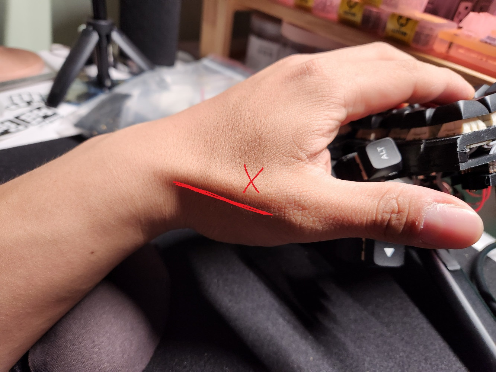
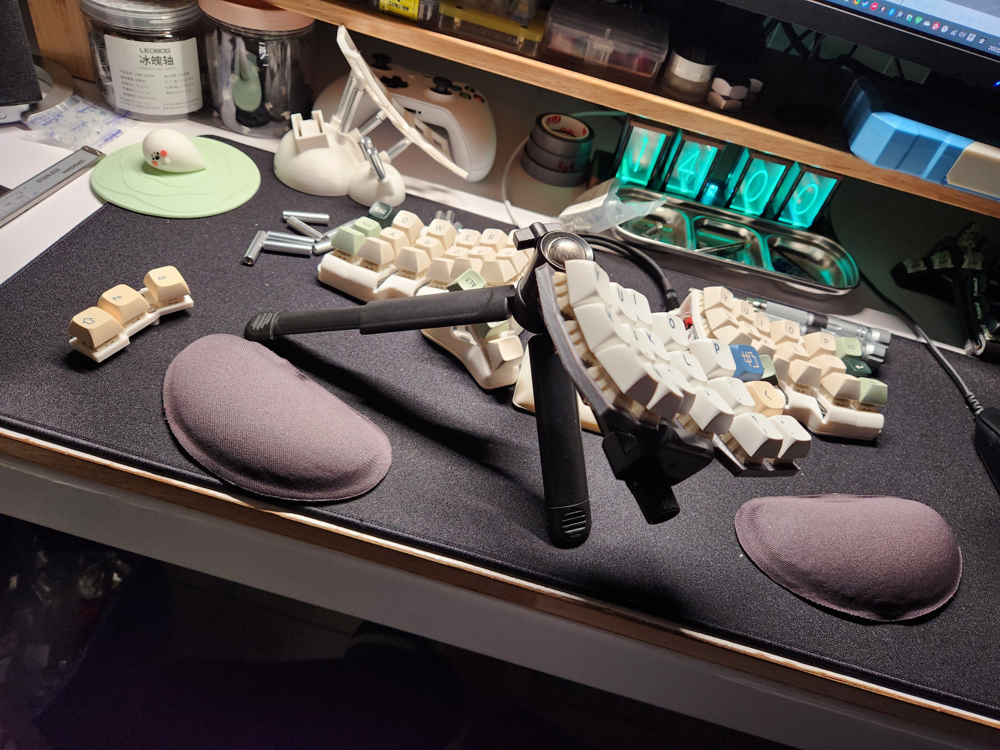

# 開發日誌

## 開發歷史

- 2022.12.26 正式組裝第一把TBKmini。
- 2023.01.09 正式完成Dactyl Manuform 5x6。
- 2023.01.16 完成第二把TBKmini（完全手拉矩陣），改寫QMK韌體。
- 2023.01.26 正式安裝[Fusion360](https://www.autodesk.com/products/fusion-360/overview?term=1-YEAR&tab=subscription)在個人電腦上。
- 2023.01.31 請James列印的Skeleton Edition入手。
- 2023.02.11 第一款失敗模型設計成品入手。
- 2023.02.28 第二款失敗模型設計成品入手，到03.07才知道它也是失敗模型。
- 2023.03.08 探索者第一版雛形成品完成。
- 2023.03.14 探索者第二版模型完成。
- 2023.03.22 探索者Prototype單手模型完成。
- 2023.04.01 探索者正式命名為系列，3x6+3鍵盤完成、測試。
- 2023.04.15 正式命名RxCT為探索者1號。
- 2023.04.23 探索者1號檔案Github正式開源。
- 2023.04.24 探索者1號登上[KBDNews](https://kbd.news/Explorer-RxCT-1994.html)。

## 開發心得

探索者1號的開發大約花了一個半至兩個月的時間，很多人會認為一把這樣需要調整這麼多參數的分離式機械鍵盤需要花相當多的時間去完成，通常大部分人認知是這樣沒有錯。但這真的是事實，我在2023年1月26日正式在我個人的電腦上安裝[Fusion360](https://www.autodesk.com/products/fusion-360/overview?term=1-YEAR&tab=subscription)，安裝這個AutoDesk這款工程3D軟體的時候，我連3D繪圖都不了解。

沒有錯，我是個3D繪圖基礎都沒有的新手，對於自己設計分離式鍵盤來說，這毫無疑問是相當大地挑戰，前前後後自己找了網路資源慢慢學習，學了一個步驟之後就直接開軟體實作，實作的對象就直接是鍵盤本體。

真的要說我失敗了幾次嘛... 也有20次以上了，實際加上James Sa協助我做3D列印的服務的時候都要謹慎，不是所有設計出來的東西都是可以100%列印成功的，即便成功好了，實際模型是不是可以運作也是一大課題；嚴格來說James協助我做3D列印服務，我們雙方也是種買賣關係，僅僅在設計鍵盤方面有著相同的背景，我真的很感謝他，讓我這個瘋子能夠順利地完成這把鍵盤。

## 設計理念

從我開始入手使用分離式人體工學鍵盤後，就一直發現每把鍵盤都有1個到2個我覺得是缺點的地方，打個比方：

- [Corne](https://github.com/foostan/crkbd)的拇指區，最內側的按鍵真的是相當的難按，而且相當的不舒適。
- [TBKmini](https://github.com/Bastardkb/TBK-Mini)則是中指太過於下凹，導致我在移動食指中指的時候非常容易卡到鍵帽。
- [TBKmini](https://github.com/Bastardkb/TBK-Mini)後來經過James的指導後發現拇指區正常擺放時也會有傷害到手指的疑慮，觀察過後真的是如此。
- [Skeleton Edition](https://github.com/atsuyuki/dactyl-manuform-skeleton-edition-4x5)原本會是我的下一把鍵盤，但礙於沒有3x6+3的配列，也就成為我開始設計鍵盤的主因之一。
- [Dactyl Manuform](https://github.com/abstracthat/dactyl-manuform)則是體積太大，底座太高，不然它真的相當的舒適。

綜合起來歸納出來幾點是我想改進的：

- 長得像TBKmini的3x6+3，合計42鍵的鍵盤。
- 根據使用鍵盤時手指正常移動的軌跡後發現需要讓中指區跟食指、無名指區域齊平。

- 拇指區要能夠遵守正常擺放及使用不會把筋爆出來的原則。

- 拇指區要能夠微調角度。
- 長得要跟[Skeleton Edition](https://github.com/atsuyuki/dactyl-manuform-skeleton-edition-4x5)一樣Cyberpunk。

## 設計過程

起初就是因為Facebook社團[Mechanical Keyboards USA](https://www.facebook.com/groups/mechanicalkeyboardsusa)的一位老哥在我的文章底下的留言，說自己嘗試組裝Skeleton Edition失敗，於是問了怎麼個失敗法？結果對方也沒有回覆我，一直讓我通靈解決問題，但同時我也被這把鍵盤那Cyberpunk的外觀給煞到了，當時又處於[EdgeRunners](https://www.cyberpunk.net/zh-tw/edgerunners)的流行期間，我當時所有的Fusion360的鍵盤設計都有那個味道在...

第一次設計出來的模型長的跟Skeleton Edition非常相似，底座更改為球體，走線都走在球體內，但我沒有想到3D列印的公差，於是整個模型呈現一個大失敗，熱壓螺母的定位孔也直接崩解，不鏽鋼柱由於沒有計算到公差而無法順利的安裝，甚至有一處直接被我壓到裂開；定位板的部分則是沒有計算好按鍵跟按鍵之間的距離，導致安裝好鍵帽之後直接卡死。最後詢問James大致上3D列印的公差後，正式開始了第二次的設計。

我在第一次的模型設計後就有發現，拇指區相當難設計，主鍵區真的還好，我很早就設計出來，而且有很多不同的構想。有了第一次的失敗，我就決定慢慢來，第二次設計的時候循序漸進先將主鍵區的公差搞定，結果左右距離過遠，但確實手感相當的好，於是就依據這個主鍵區模型開始後續探索者的設計...

為什麼會想到雲台？有一天我在整理收納空間的時候翻到之前被我擺在一旁沒有用到的手機支架，支架上剛好有一個雲台，就這樣把構想告訴James之後，第一個探索者的模型誕生了。

第一版的雛形是將前方雲台座整跟底部的雲台座一體成形，但後來體積實在是太大，鍵盤整體的高度太過，於是將這個設計捨棄掉，另闢一個新的設計。

第二版將底部雲台座整個分離，原先是想要將這個可以分離的雲台座卸下安裝在前端，好達成壓低鍵盤厚度的構想。但實際設計好後才發現不如一開始就將雲台設計在底部，用外掛插件的形式將雲台座設計在前端。

就這麼思索還可以怎麼設計的時候，眼睛盯著當時擺在我眼前的TBKmini，於是就花了點時間觀察它，看著我覺得一直是缺點的中指凹陷處、開槽直接裸露裡面內部走線的洞口，最後看到按鍵中間的開槽，於是就有了一個很特別的想法：

"那不如就把這個直列部分直接切成6等份，做一個可以模組化的鍵盤？"

這就是這把鍵盤模組化的起源，後續在設計的時候就一直朝著這個構想前進，有什麼遇到困難的地方，就是一個轉念讓自己好好的思考模組化可以怎麼設計。

