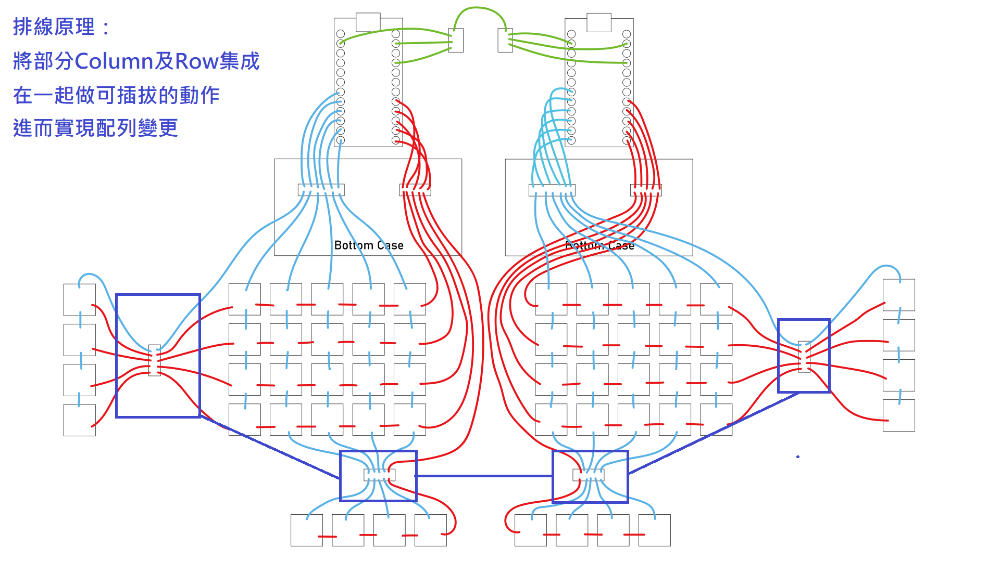
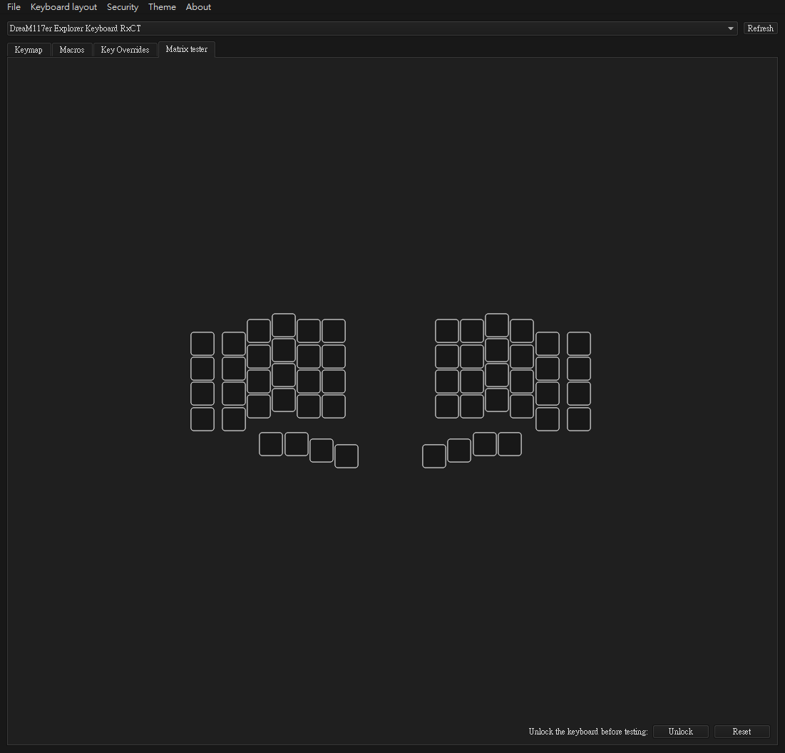
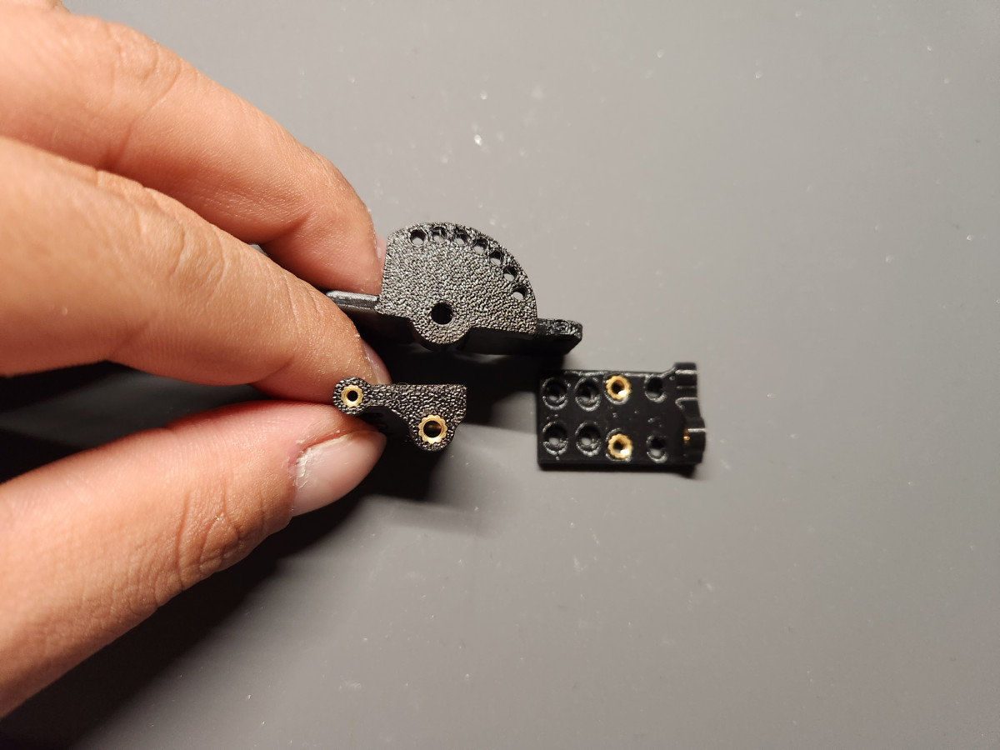

# 操作說明

> **注意事項**
> 務必先將鍵盤[安裝完畢](guide.md)後再來看操作說明。

## （一）安裝雲台腳架

### A、雲台安裝需求

> **Warning**
>
> 探索者1號是完全支援雲台的分離式鍵盤，沒有其他的安裝方式，但也不是什麼雲台配件都可以使用，這裡我會列出以下幾點安裝雲台時的要求：
>  - 底板面積要大。
>  - 底座要比單手鍵盤本體重量要重。

> **Note**
>
> 建議配置[Arca快拆系統](https://www.google.com.tw/search?q=arca+tripod&sxsrf=APwXEddPAT1f29tii0hugS33QeRQuseIqA%3A1684040734940&ei=HmxgZLWHOZiD-AadibfoCw&ved=0ahUKEwi1jqzOhPT-AhWYAd4KHZ3EDb0Q4dUDCBA&uact=5&oq=arca+tripod&gs_lcp=Cgxnd3Mtd2l6LXNlcnAQA0oECEEYAFAAWABgAGgAcAF4AIABAIgBAJIBAJgBAA&sclient=gws-wiz-serp)：
>   - 留意整體大小不要衝突主控座，特別是有線TRRS座主控座的安裝。
>   - 穩固鍵盤本體。
>   - 快速拆卸雲台，方便直接調整底座的角度。

### B、雲台安裝步驟

> **Warning**
>
> 以下說明並非廠商廣告，請當作參考閱讀。

- 我使用的雲台配件如下，[SmallRig](https://www.smallrig.com/)：[1092](https://www.smallrig.com/cool-cheese-plate-v3-multi-purpose-mounting-plate-1092.html)、[2065](https://www.smallrig.com/smallrig-articulating-arm-5-5-inches-2065.html)，[Falcam](https://www.falcam.com.cn/)：[F38 series 2400（2465）](https://www.falcam.com.cn/falcam-f38-pd-quick-release-plate-2465_p64.html)、[2401](https://www.falcam.com.cn/falcam-f38-anti-deflection-quick-release-plate-2401_p61.html)。

- 首先安裝單邊魔術手臂到洞洞板的位置上。

- 再將魔術手臂角度稍微調整一下。

- 將魔術手臂鎖緊固定好。

- 將Arca快拆系統母座安裝上去。

- 再將另一支手臂安裝好。

- 接著將Arca子板安裝在鍵盤雲台上。

- 螺絲鎖緊。

- 接著就可將鍵盤安裝在底座上了。

- 完成會是這樣的感覺：

- 最後再調整魔術手臂的角度，選定一個喜歡的角度後再將魔術手臂固定好。

- 接上TRRS線。

- 再將鍵盤連接到電腦。

- 完成！

## （二）排線原理及VIAL QMK按鍵設定

### 排線原理

> **Note**
>
> 也閱讀到操作說明這邊的讀者，假如你/妳是按照標準的排線安裝流程組裝鍵盤的話，這邊會告訴你這樣做的原理：

> **Note**
>
> 也除了將矩陣用排針的形式拓展之外，這樣做的原理還可以當作另一種開關的形式。打個比方：我要在4x5主配列上做1列的拓展，就將拓展上的排線接上去，鍵盤就會立即辨識。也就是說，在還沒有接上拓展排線時，鍵盤拓展為Off，接上的時候為On。

> **Note**
>
> 也就是說，你要使用拓展，就將拓展的排線接上去，底殼螺絲鎖上，這樣就可以無痛升級。

### VIAL按鍵設定

> **Warning**
>
> 探索者1號不限配列，統一使用一個韌體，這樣設計的原因為增加鍵盤的可玩性，接著來說明VIAL要如何改按鍵。

- 首先進入VIAL，探索者的鍵盤排列會長這樣：

- 簡單介紹一下物理層面控制的位置，所有框起來的部分是可依據現有配列去做更動的，沒有用到那顆按鍵或是沒有那顆（排）按鍵，就不要在那個位置設定鍵位，即使你設定了，你也沒辦法讓電腦辨識。

- 打個比方，作者本人的配列屬於3x6+3，合計42鍵的鍵位，因此在VIAL上，我可以設定鍵位的地方如下：

> **Warning**
>
> 沒有被紅色區塊框起來的地方就算有設定鍵位也沒辦法按，這點大家在改按鍵的時候特別注意。

## （三）基礎配列

> **Note**
>
> 探索者1號在設計的時候是以同一個拇指區基座為基底設計，有3x5及4x5可以選擇。

### A、3x5配列

### B、4x5配列

### C、3x6配列

### D、4x6配列

## （四）特殊配列

> **Note**
>
> 以下配列都是可以運行且正常使用的，不用懷疑。

### A、標準VIAL預設配列

### B、左手4x5+3、右手3x6+3

### C、左手3x6+3、右手標準VIAL配列

## （五）拇指區

> **Warning**
>
> 拇指區會根據是否為直接焊接Row或是可插拔按鍵的安裝形式有不同的變更模式。

> **Note**
>
> 操作說明這裡提到的拇指區為已經安裝完畢的鍵盤。

### A、調整角度

- 首先將拇指區基座螺絲卸下。

- 再將排線跟主鍵盤分離，卸下拇指區。

- 接著將拇指基座上的螺絲卸下，將拇指底板跟基座分離。

> **Note**
>
> 基座部分有0～90度可以調整拇指區，合計7個檔位可以選擇。

- 選好想要微調的角度後，再將螺絲鎖回去。

- 再將排線對號順序接回去。

- 完成！

### B、定位板挪移

> **Warning**
>
> 直接焊接Row拇指區的話，唯一可以變更的只有底板樣式，請往下看操作說明。

- 按照調整角度拆卸方式，將拇指區卸下。

- 型號A的長底板可以將拇指定位板做前後挪移，這裡先示範移動空白鍵。

- 首先將空白鍵底板上的螺絲卸下。

- 將空白鍵移動至要變更的螺絲孔位。

- 再將螺絲鎖回去。

- 接著將拇指區基座裝回去。

- 效果會是這樣。

> **Note**
>
> 這是只有變更單鍵的底板，如果全部固定的按鍵都要變更底板的話，就將所有的底板拆下來，把底板變更完畢後再裝回去。

### C、變更底板

> **Warning**
>
> 只有AA及AB底板可以連接基座，這裡再強調一次。

- 首先將拇指區跟基座卸下。

- 接著將基座調整到另一片可連接基座的底板上。

- 將基座安裝上去。

- 接著再將排線接在主鍵盤上。

- 最後將拇指基座安裝回去。

- 效果圖：

- 雙手對比：

### D、變更按鍵數量

> **Warning**
>
> 直接焊接Row拇指區的話，需要動用電烙鐵才可變更按鍵數量。

> **Note**
>
> 可插拔按鍵才可直接插拔變更按鍵數量，請下拉閱讀操作說明。

- 首先將拇指區跟基座卸下。

- 接著來示範將這顆最內側的按鍵卸掉。

- 將最內側按鍵下方的螺絲卸下，分離按鍵。

- 再將隔壁的按鍵也卸下。

- 再來把連接器上頭的固定螺絲解下，分離底板。

- 接著把卸除的按鍵鎖回去。

- 最後把調整好的拇指按鍵接上基座。

- 依據配線圖將最外側按鍵的排線接回去。

- 效果會是這樣，排線會少一條。

- 將基座安裝回去就完成了。

- 效果會是這樣：

- 雙手鍵盤對比。

## （六）結語

- 如果真的有人組完鍵盤並且閱讀到這裡，真的恭喜你/妳獲得一把自由度極高的分離式鍵盤，喜歡它的話，可以將它分享出去。
- 如果有人組裝好願意分享照片給我的話，可以用任何方式聯繫我，我會將鍵盤的美照放在下方展示給大家知道。

> **Note**
>
> 最後最後，我想告訴大家，我把改裝的自由度給了你，讓你去探索它，這就是為什麼我將它命名為探索者，希望你能愛上鍵盤，玩出新花樣。
>
> 謝謝大家。

## （七）照片展示區

> **Note**
>
> 待更新。

